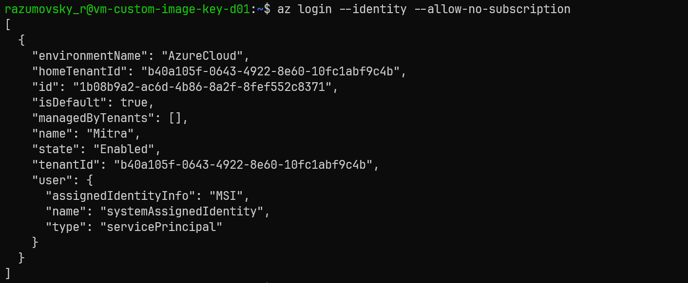
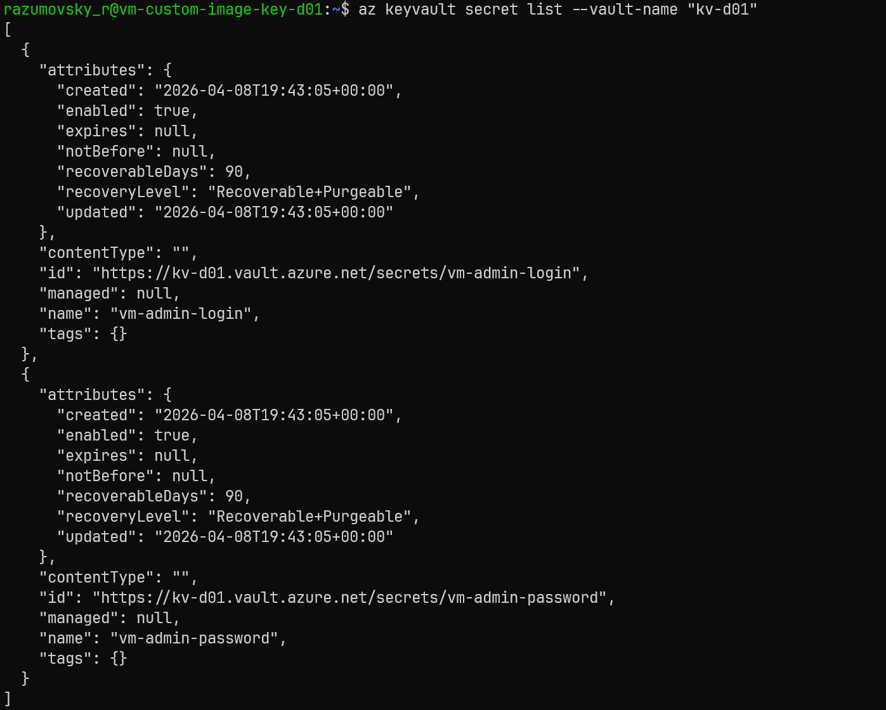
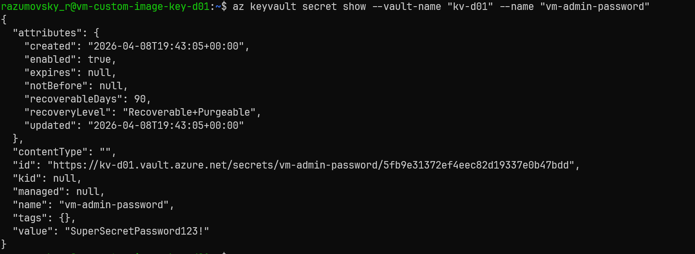

# Azure Managed Identity RBAC for Key Vault access

## Az Login


## List secrets


## Show secret


## Azure naming conventions

- [Define your naming convention](https://learn.microsoft.com/en-us/azure/cloud-adoption-framework/ready/azure-best-practices/resource-naming)
- [Azure naming module](https://registry.terraform.io/modules/Azure/naming/azurerm/latest)

## Terraform Init

- Create and configure Azure Storage Account for Terraform state
- Create `azure.sas.conf` file with the following content:
    ```bash
    storage_account_name = "storage_account_name"
    container_name       = "container_name"
    key                  = "terraform.tfstate"
    sas_token            = "sas_token"
    ```
- `terraform init -backend-config="azure.sas.conf" -reconfigure -upgrade`

## Module referencing

- Bitbucket SSH: `git::git@bitbucket.org:kolosovpetro/terraform.git//modules/storage`
- Github SSH: `git::git@github.com:kolosovpetro/terraform.git//modules/storage`
- Github HTTP: `github.com/kolosovpetro/AzureLinuxVMTerraform.git//modules/ubuntu-vm-key-auth-no-pip?ref=master`

## Pre-commit configuration

- Install python3 via Windows Store
- `pip install --upgrade pip`
- `pip install pre-commit`
- Update PATH variable
- `pre-commit install`

### Install terraform docs

- `choco install terraform-docs`

### Install tflint

- `choco install tflint`

### Documentation

- https://github.com/antonbabenko/pre-commit-terraform
- https://github.com/kolosovpetro/AzureTerraformBackend
- https://github.com/terraform-docs/terraform-docs
- https://terraform-docs.io/user-guide/installation/
- https://pre-commit.com/

## Deploy storage account for terraform state

- See [CreateAzureStorageAccount.ps1](./CreateAzureStorageAccount.ps1)
